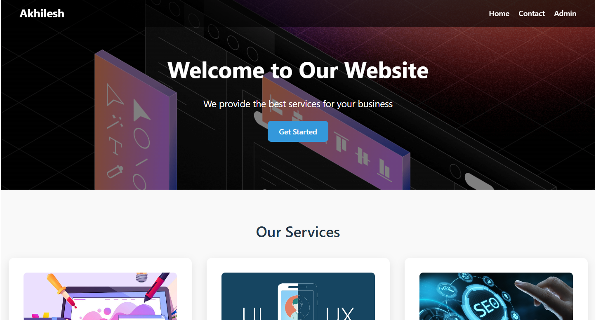

# Web Developer Assignment – Aurastha Digital Marketing

## Overview
This project is a **3-page responsive website** (Home + Contact+ Admin) built as part of the Web Developer assignment for Aurastha Digital Marketing. The website showcases **services**, **testimonials**, and includes a **contact form** with validation and a Admin Login page. It’s built using **React** and deployed on **Netlify & Vercel**.

---

## Live Demo
[Live Website netlify](https://akhileshservice.netlify.app/) and
[Live website vercel](https://service-website-react-sigma.vercel.app/)

## GitHub Repository
[GitHub Repo](https://github.com/itz-akhilesh/Service-Website-React)

---

## Features

- **Responsive Design:** Works seamlessly on desktop, tablet, and mobile devices.  
- **Services Section:** Includes Web Development, UI/UX Design, and SEO Optimization with card layouts.  
- **Testimonials Section:** Displays customer feedback with ratings.  
- **Contact Form:** Simple form with input validation for name, email, and message.  
- **Hero Section:** Eye-catching hero banner with background image.  
- **SPA Routing:** All pages handled with `react-router-dom`, with `_redirects` (Netlify) and `vercel.json` (Vercel) ensuring proper navigation.

---

## SEO & Performance

- Proper **title tags** and **meta descriptions** added.  
- All images include **alt attributes**.  
- Correct **heading hierarchy** used (`h1`, `h2`, `h3`).  
- Optimized for **fast loading** and responsive layout.

---

## Tools & Technologies

- **Frontend:** React, JSX, CSS  
- **Routing:** react-router-dom  
- **Build Tool:** Vite  
- **API:** JSONPlaceholder (dummy posts)  
- **Deployment:** Netlify / Vercel  

---
## Screenshots

### Home Page

## Approach

I started by planning the layout and wireframes for Home and Contact pages. Components were created for Header, Footer, Hero, Services, Testimonials, and Contact Form. I ensured the site was **fully responsive** and SEO-friendly. Finally, the project was built using Vite and deployed with SPA routing configured for both Netlify and Vercel.

---

## Submission

- **Live Website:** [https://service-website-react-sigma.vercel.app/]   and [https://akhileshservice.netlify.app/]
- **GitHub Repo:** [https://github.com/itz-akhilesh/Service-Website-React]  
- **Tools Used:** React, Bun, Vite, CSS, Netlify/Vercel, JSONPlaceholder API  
- **Deadline:** [8 sept]
